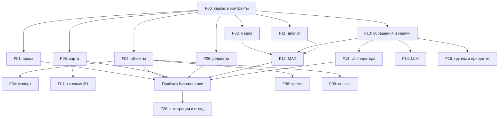

# Промпты для разработки портала строительства Тульской области

Этот пакет превращает технический план в 27 ограниченных заданий для LLM-агентов и разработчиков. Он подготовлен для генерации кода, но код приложения ещё не реализован. Предлагаемые пути и контракты проверяются и фиксируются заданием F00.

## Как начать

1. Перенесите содержимое этой папки в docs/agent-prompts/ целевого репозитория.
2. Назначьте интегратора — владельца общих контрактов, root-конфигурации, lockfile, порядка миграций и композиции приложений.
3. Выполните F00. До его приёмки можно собирать доступы/контент, но не поручать разным агентам независимо проектировать общую API/БД.
4. После F00 запускайте задания по волнам ниже, в отдельных ветках/worktree.
5. Передавайте агенту общий документ, контракты и ровно одну фичу с выбранным режимом.
6. Принимайте результат через сценарии фичи и handoff. Фоновый mock не считается работающим сервером или внешней интеграцией.
7. Ветки интегрирует ответственный по F26 после каждой волны, а не только в день защиты.

Пакет также собран в [один Markdown-файл](../tula-agent-prompts-all.md). Для передачи всей команде доступен архив рядом с этим пакетом.

## Готовый стартовый промпт — первый агент

```text
Мы создаём портал строительства Тульской области.
В репозитории есть docs/agent-prompts.
Прочитай 00-common.md, 01-contracts.md и features/F00-foundation.md.
Выполни F00 в режиме MVP: запускаемый каркас, общие схемы и клиент,
fixtures, команды проверки и схема владения файлами.
В существующем репозитории сохрани его структуру и принятый стек,
предварительно зафиксировав соответствие плану.
Не реализуй остальные фичи автоматически.
Проверь результат и создай docs/handoffs/F00.md.
Не заявляй выполненными проверки, которые не запускал.
```

## Готовый промпт — типовые 3D-модели

```text
Прочитай docs/agent-prompts/00-common.md, 01-contracts.md
и features/F07-3d-models.md. Реализуй F07 в режиме MVP.
Используй процедурные типовые модели Three.js по типам сооружений:
школа, детсад, медицина, спорт, культура, жильё, котельная,
водоснабжение, очистные и нейтральный тип.
Модель реального здания и внешние GLB для MVP не требуются.
Сохрани GenericModelFactory и MapExtension из общих контрактов.
Показывай, что модель условная; не выдавай её размеры за измеренные.
Работай только в зоне F07 и передай интегратору подключение к карте.
Проверь типы, позиции, переключение статусов, fallback и освобождение ресурсов.
Заверши docs/handoffs/F07.md.
```

## Готовый промпт — следующий уровень 3D

```text
Прочитай общие документы и features/F07-3d-models.md.
MVP F07 уже принят. Реализуй только V2:
каталог подготовленных GLB, проверку assets, настройки трансформации,
ограничения размера и fallback на процедурную модель.
Не переписывай MapRuntime и не делай обязательным наличие
точных моделей реальных сооружений.
Если каталог GLB ещё не предоставлен, реализуй loader на собственном
минимальном fixture и явно укажи, какие ассеты остаётся подготовить.
```

Для других фич замените ID, имя файла и выбранный режим. Техническое задание в каждом файле уже содержит входы, результаты, файлы, шаги и приёмку.
В режиме MVP разделы V2/TARGET служат ориентиром совместимости; агент не должен реализовывать их заодно.

## Что читать

- [00-common.md](00-common.md): инструкции выполнения, стек, границы владения, команды проверки.
- [01-contracts.md](01-contracts.md): DTO, статусы, API, интерфейсы модулей, семантика данных.
- [02-handoff.md](02-handoff.md): результат, который агент передаёт интегратору.
- features/Fxx-*.md: конкретный готовый промпт.

Если агенту передаётся только один файл фичи, приложите также 00-common.md и 01-contracts.md. Без них задание неполное.
При передаче all.md попросите выполнять только выбранный ID и режим; остальные разделы нужны для совместимости.

## Волны разработки и контрольные точки

| Волна | Задания | Что можно делать одновременно | Gate |
|---|---|---|---|
| 0. Основа | F00 | Запрос доступов, подготовка исходников и материалов отдельно от кода | Сборка, fixtures, схемы и клиент приняты |
| 1. Независимые модули | F01, F02, F03, F05, F06, F10, F11 | Auth, media, objects API, public UI, editor UI, workflow core, bot engine на замороженных контрактах | UI/mock и backend/unit готовы; live только после поставщиков |
| 2. Первый рабочий цикл | F04, F07 MVP, F12, F13, F26 P0 | Импорт после objects; типовые 3D после map; MAX после media/bot/workflow; UI оператора после workflow | Публикация → карта → обращение → задача → ответ |
| 3. Демонстрационные отличия | F08, F09, F14, F15, F26 demo | История, польза, анализ, группировка; F09 current MVP не ждёт исторического режима | Данные/даты согласованы; recommendations не изменяют workflow сами |
| 4. Расширения | F16–F25 по выбранному scope | Независимые слои/адаптеры с готовыми потребителями | Каждая интеграция подтверждена либо явно обозначена её недоступность |
| 5. Целевые варианты | V2/TARGET принятых фич | Отдельные улучшения при сохранении contracts/migrations | Регрессии MVP проходят, внешняя приёмка проведена |

«Можно параллельно» означает независимую реализацию с общими contract fixtures.
Пример: F05 UI можно делать до сервера F03, но финальный live сценарий нельзя принять до F03. F11 engine можно писать до F10, но реально зарегистрировать обращение он сможет только после интеграции.



Диаграмма показывает ключевые live-зависимости; полные условия каждой фичи находятся в её файле.

## Вариант распределения по людям

Это роли, а не требование к численности. Один человек может вести несколько последовательных заданий.

| Направление | Основной поток |
|---|---|
| Интегратор / backend объектов | F00 → F01/F03 → F04 → интеграционные gates F26 |
| Frontend публичного сайта / 3D | F05 → F07 MVP → F08 UI/F09 UI → F17/F18/F19 |
| Frontend админки | F06 → F13 → подключение панелей F14/F15/F16 |
| Backend обращений / интеграции | F02 → F10/F11 → F12 → F25 |
| Данные / аналитика, если есть пятый участник | Исходники → F08/F09 backend → F14/F15 → F16/F20 |

Если одна фича разделяется между backend и frontend, интегратор сначала выдаёт два отдельных ownership-блока внутри неё. Не поручайте двум агентам редактировать весь F08 или F09 одновременно.
При четырёх участниках задачи пятого направления распределяются последовательно после P0.
Реальные сроки зависят от текущего кода, навыков команды, критериев и доступов; длительность LLM-сессии не является надёжной оценкой разработки.

## Версии сложных возможностей

| Возможность | MVP | V2 / промежуточный уровень | TARGET |
|---|---|---|---|
| 3D | Процедурные типовые формы, GENERIC | Каталог GLB по типам, loader и редактор transform | Проверенные модели 3 объектов, LOD, точная привязка и подтверждённые этапы |
| История | FACT/PLAN, ручная шкала, известные даты | Playback, интервалы и предзагрузка | Две временные оси, версии границ, материализованные срезы |
| Польза | Введено; полная формула только при известных входах | Можно выполнять следующие целевые шаги отдельно | Замены/выбытия, население, территории, версии методик |
| MAX | State machine + simulator и реальный adapter отдельными F11/F12 | Живой round trip после доступов | Мониторинг подписки, reconciliation и эксплуатация |
| LLM | OFF/FIXTURE/LIVE port, JSON и ручной review | Реальный provider, shortlist и утверждённые правила | Evaluation, версии, согласованный анализ фото |
| Приоритет | Ручной уровень + видимые факторы | Версионированный rules score, demo веса явно помечены | Проверенный score, semantic ranking, исправление ошибочных групп |
| Изохроны | Подписанный приблизительный радиус либо готовые полигоны | Реальный pedestrian routing provider | Собственный обновляемый граф и проверенные профили |
| Контракты | Ручная подтверждённая ссылка | — | Официальный импорт/API и история изменений |
| Камеры | Датированные фото/одобренный snapshot | — | Поток через media gateway, таймлапсы и мониторинг |
| ПОС | Выключенный port + тестовый transport | — | Документированный sandbox и реальная синхронизация |

MVP пакета содержит самостоятельные упрощения. Если критерии хакатона требуют реальные изохроны, камеры или точные модели, соответствующий V2/TARGET становится обязательным для защиты. Снижение версии не отменяет критерий заказчика.

## Каталог заданий

| Задание | Приоритет | Исполнитель |
|---|---|---|
| [F00. Каркас репозитория и заморозка контрактов](features/F00-foundation.md) | Обязательный старт | Интегратор / backend |
| [F01. Вход сотрудников, права и аудит](features/F01-access-audit.md) | P0 | Backend / безопасность доступа |
| [F02. Фотографии, документы и файловое хранилище](features/F02-media-storage.md) | P0 | Backend / медиа |
| [F03. Реестр проектов, объекты и публикация](features/F03-objects-api.md) | P0 | Backend объектов |
| [F04. Импорт Excel/CSV и контроль качества](features/F04-imports.md) | P0 | Данные / backend |
| [F05. Публичная карта, список и карточки](features/F05-public-map.md) | P0 | Frontend карты |
| [F06. Редактор объектов, геометрия и публикация](features/F06-admin-objects.md) | P0 | Frontend админки |
| [F07. 3D: типовые сооружения → GLB → реальные модели](features/F07-3d-models.md) | P1, рекомендуемая ранняя демонстрация | 3D / frontend |
| [F08. Датированные события и временная шкала](features/F08-timeline.md) | P1 | Backend + frontend аналитики |
| [F09. Мощности и польза для территории](features/F09-benefits.md) | P1 | Аналитика / backend + frontend |
| [F10. Регистрация обращений и задачи исполнителей](features/F10-appeals-tasks-core.md) | P0 | Backend обращений |
| [F11. Сохраняемый диалог бота и локальный симулятор](features/F11-bot-dialogue.md) | P0 | Бот / backend интеграций |
| [F12. MAX: входящие события, файлы и уведомления](features/F12-max-adapter.md) | P0, внешний доступ обязателен для полной приёмки | Интеграции |
| [F13. Рабочее место оператора и исполнителя](features/F13-admin-workflow.md) | P0 | Frontend админки |
| [F14. Предварительный разбор LLM с проверкой сотрудником](features/F14-llm-triage.md) | P1 | LLM / backend |
| [F15. Похожие обращения, объединение и объяснимый приоритет](features/F15-grouping-priority.md) | P1 | Backend аналитики обращений |
| [F16. Мнение жителей и окраска территорий](features/F16-resident-surveys.md) | P2, зависит от источника опросов | Аналитика / frontend |
| [F17. Миниатюры объектов за краями карты](features/F17-edge-navigation.md) | P2 | Frontend карты |
| [F18. Экскурсия «Итоги за минуту»](features/F18-guided-tour.md) | P2 | Frontend сценариев |
| [F19. Фотосравнение «До / Сейчас / После»](features/F19-photo-comparison.md) | P2 | Frontend медиа |
| [F20. Итоги муниципалитета и тематические подборки](features/F20-municipality-summary.md) | P2 | Frontend + аналитика |
| [F21. Пешеходные изохроны 10–15 минут](features/F21-isochrones.md) | P2 или обязательная функция по критериям | GIS / интеграции |
| [F22. Сведения о строительных контрактах](features/F22-contracts-data.md) | P2 или обязательная функция по критериям | Интеграции данных |
| [F23. Камеры стройки и таймлапсы](features/F23-cameras-timelapse.md) | P2 или обязательная функция по критериям | Медиа / интеграции |
| [F24. Интеграция с ПОС или внешней системой обращений](features/F24-pos-integration.md) | Отдельный объём после получения требований | Интеграции ведомства |
| [F25. Подтверждение устранения жителем](features/F25-resident-confirmation.md) | P2 | Бот / workflow |
| [F26. Сквозная интеграция, проверка и выпуск стенда](features/F26-integration-release.md) | Обязательный gate; повторяется после каждой волны | Интегратор / QA / инфраструктура |

## Общие точки, которые нельзя менять независимо

1. Enums и DTO: contracts v1 — единственный источник. Не вводить finished в одном модуле и completed в другом.
2. Draft/publication: все дочерние данные читаются из опубликованной редакции.
3. Appeal/Task: связь и статусы определяет F10, панели F13/F14/F15 не создают свои таблицы статусов.
4. Inbox/outbox: создание бизнес-данных и ожидающих уведомлений атомарно; Redis не единственное хранилище.
5. MapRuntime: F07/F17/F18 не создают вторую камеру или собственный источник выбранного объекта.
6. Общие root-файлы и миграции подключает интегратор. Внутренний код каждой фичи принадлежит её исполнителю.
7. Public media и private appeal files проверяются F02/F01; URL браузера и provider URL не заменяют сохранённый asset.
8. Реальные и демонстрационные данные, generic/verified модели и approximate/route-based зоны различаются в данных и UI.

## Готовность передачи команде

В пакет входят задания и предлагаемые контракты. Здесь не утверждается, что существуют доступы MAX/LLM/ПОС, реальные исходные таблицы, фотографии или модели.
Перед стартом определите целевой репозиторий, выбранный release-scope, ответственного за интеграцию и доступы. F00 проверит конфигурацию и команды на этом репозитории.

## Документация для проверки интеграций

Ссылки на официальные источники, использованные при первоначальном плане; агент интеграции проверяет актуальность на дату реализации:
- [3D-слой MapLibre с Three.js](https://maplibre.org/maplibre-gl-js/docs/examples/add-a-3d-model-using-threejs/).
- [PostGIS: геометрии и индексы](https://postgis.net/docs/using_postgis_dbmanagement.html).
- [NestJS: очереди BullMQ](https://docs.nestjs.com/techniques/queues).
- [MAX: API бота и deep links](https://dev.max.ru/docs/chatbots/bots-coding/prepare).
- [MAX: требования webhook](https://dev.max.ru/docs-api/methods/POST/subscriptions).

